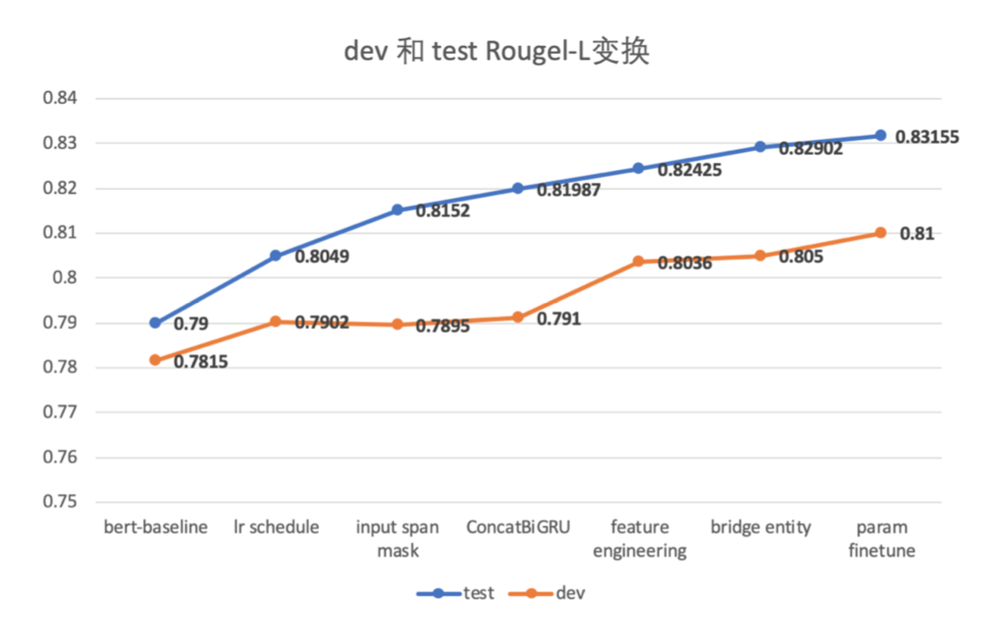

# les-military-mrc
[莱斯杯：全国第二届“军事智能机器阅读”挑战赛](https://www.kesci.com/home/competition/5d142d8cbb14e6002c04e14a) Rank7 解决方案（baseline）。

## Architecture
本次竞赛数据呈现如下特点:
- 每个问题包含五篇长度较长且存在一定噪声的文档;
- 部分问题需要基于桥接实体的深层次的推理;
- 部分问题可能包含多答案，多答案可能来自一个文档或多个文档。

为解决上述问题，本团队采用如下图所示的整体技术架构:

## Text Preprocess
为方便后续模型训练处理，将数据集转化成 dureader 格式。由于原始文本 中包含大量噪声文本，采用的数据清洗包括:
- \u200b、\x10、\f、\r 等(unicode)空字符的去除; l 相关 url 链接、html 标签的去除
- 处理------，.....，等类型的重复字符
- 广告文本的去除
- 去除空段落和重复段落

## Paragraph Selection
由于文档长度较长，为保证筛选的上下文长度尽量短以及答案覆盖率，我 们采用以答案为基本中心，截取的最大长度 max_doc_len 为 1024，具体做法（此方法未进行复杂的段落筛选，简化成以答案为基本中心的裁剪）:
- 对于长度小于 1024 的文档，全部保留;
- 长度大于 1024 且答案位置在偏左侧上下文中，截取前 1024 长度;
- 长度大于 1024 且答案位置在偏右侧上下文中，截取前 1024 长度;
- 以上均不满足，则以答案为基本中心(中心点存在随机性)，截取 1024长度

注意，在文档长度较长且答案基本处于中间位置的情况，为避免截断过程中存在的答案位置的偏置，本方案设置了答案开始下标距离文档左边界的随机性，截断方法如下图所示:

## Features
- 利用 [jieba](https://github.com/fxsjy/jieba) 分词工具提取问题和文档的 POS、
Keyword 特征，同时针对文档的每个字符提取是否在问题中出现的 doc_char_in_question 特征;
- 利用 [foolnltk](https://github.com/rockyzhengwu/FoolNLTK) 工具提取
问题和文档的命名实体，一共包含 7 类实体，并进行 one-hot 处理

## Experiment

## Teammates
**Lucky Boys**
- [QingLiu](https://github.com/SunnyMarkLiu)
- [ZiqiangYing](https://github.com/YingZiqiang)

## License
This project is licensed under the terms of the MIT license.
